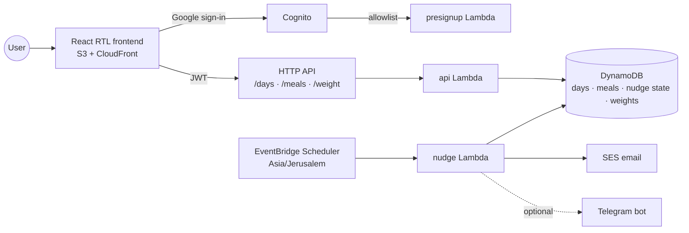

# diet-tracker

Free multi-user SaaS: a serverless Hebrew diet tracker built around an intraday meal log. No
calories are counted: what the log scores is the character of each meal and the intervals between
meals, in points golf-style — lower is better.

**[Walk through a tracked day](https://dwyjxouhdjlxp.cloudfront.net/demo.html)** — an animated
replay of one session on a phone screen: sign-in, three meals logged as they happen, the day
closed from the tracker, and the week's trend over recorded history.

## Overview

- Four principles carry the whole tracker: drinking enough water, vegetables in your meals, a short
  eating window, and few meals a day. Their Hebrew initials spell שכפ"צ, the prefix every question
  in the app carries, and a table at the foot of the signed-out page lists them with their targets.
- You log each meal as you eat it, and can still fill in yesterday after midnight. Those entries
  answer three of the four principles by themselves — vegetables, eating window and meal count —
  and add a carb score for flours and sugars, where lower is better.
- Water is the one principle meals cannot answer, so a short end-of-day questionnaire asks for it.
  What was already recorded sets the floor there: a day can admit more than was logged, never less,
  and a fully logged day closes straight from the tracker once the water is filled in.
- Weight is tracked on its own weekly rhythm, beside the daily log: each weigh-in is charted
  against a target you set, and carries the hour it was taken at, because a weekly weighing only
  compares with itself when it is taken at about the same time of day. The section reads back
  where you stand in that rhythm and opens itself on the weigh-in morning. Weight is measured
  rather than scored, so it changes no day's score and raises no alert.
- Reminders go out by email, and by Telegram where a bot token is configured: a nudge while a day
  is still unsubmitted, a last call at the end of it that says the day is open rather than
  untracked once its meals are logged, a weekly weigh-in reminder that skips anyone who already
  weighed in on the day itself, an alert when a principle or the carb score stays past its limit
  several days running, and a weekly summary of averages. The one reminder that shows up inside
  the app is the 7-day trend chart after each submit.

## Tech stack

- **Backend** — Python 3.13 Lambdas behind an HTTP API, four DynamoDB tables, EventBridge
  Scheduler (Asia/Jerusalem)
- **Frontend** — React (TypeScript + Vite) RTL app on S3 + CloudFront, Recharts, TanStack Query
- **Auth** — Cognito Google sign-in gated by a small allowlist
- **Notifications** — SES email, optional Telegram bot

## Architecture

The backend is a modular monolith on serverless infrastructure: every Lambda is a thin entry point
(`src/handlers/`) over one shared domain core (`src/common/`), and all functions deploy from a
single code package against the same DynamoDB tables. Features are separated by Python modules,
keeping the domain logic in one place while Lambda still provides independent scaling and
scheduling per entry point.

Meal scoring is implemented once per runtime — `src/common/derive.py` (the authority) and
`frontend/src/derive.ts` (live dashboard feedback) — and both must satisfy the shared vectors in
`config/derive-vectors.json`. `config/app.json` is the app-level config both runtimes read: the
questionnaire element holds the questions, their numeric choice values, and the threshold alert
rules; the weight element holds the weigh-in schedule, the chart's opening span, and the kilogram
bounds the API and the input both constrain to.

## Details

- [Domain rules](docs/domain-rules.md) — scoring model, day lifecycle, and nudge behavior
- [Development & deployment](docs/development.md) — local setup, tests, deploy scripts, and
  Telegram configuration
