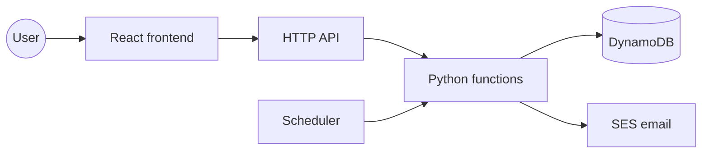

# diet-tracker

A free Hebrew diet tracker for the web, open to anyone to sign up. You log each meal as you eat
it, through the day rather than all at once in the evening. Nothing counts calories: what earns
points is the character of each meal and the gaps between them, and as in golf a lower score is
better.

**[Walk through a tracked day](https://dwyjxouhdjlxp.cloudfront.net/demo.html)** — an animated
replay of one session on a phone screen: sign-in, three meals logged as they happen, the day
closed from the tracker, and the week's trend over recorded history.

## Overview

- Four principles carry the whole tracker: drinking enough water, vegetables in your meals, a short
  eating window, and few meals a day. Their Hebrew initials spell שכפ"צ, the prefix every question
  in the app carries.
- You log each meal as you eat it, and that log alone answers three of the four: whether the
  meal had vegetables, how long the day's eating stretched, and how many meals there were.
- Water is the fourth, the one meals cannot answer, so closing the day asks for it and nothing
  else. A day closes only from the tracker, and one confirmation reopens a closed one.
- Beyond the four principles, the same entries add up to a score for the day. Each meal costs
  points for the kind of carbohydrate it drew on, how big the helping was, and anything on the
  side — a sweet, a drink, nuts, a lot of fat. A lower score is a better day.
- Weight is tracked on its own weekly rhythm against a target you set. It is measured rather than
  scored, so it changes no day's score and raises no alert.
- Under the log sit a 10-day chart and the recorded days as a table, so a week reads at a
  glance.
- Email tells you what the app cannot: a day you have not closed yet, the weekly weighing, a
  habit you have been over the line on several days running, and a summary of the week just
  gone. Telegram too, if you set up a bot for it. One switch in the account menu stops all of
  it.
- You can ask the app questions about the diet and get answers drawn from the diet's own written
  material, with the documents each answer came from. The answering is done by a separate service,
  [Summaries.AI](https://github.com/erancha/Summaries.AI-public), and every question sends your own
  recent days and meals along with it so the answer can refer to them — which means that data
  leaves this app. A chat you can share with every user, under your own address, and the chats
  other users have shared with everyone are yours to read.
- The admin account sees a list of who has signed up and how much each has been tracking —
  counts and email addresses, never anyone's recorded meals or weights.

[Feature overview](docs/features.md) describes each of these in full.

## Tech stack

- **Backend** — Python 3.13 Lambdas behind an HTTP API, seven DynamoDB tables, EventBridge
  Scheduler (Asia/Jerusalem)
- **Frontend** — React (TypeScript + Vite) RTL app on S3 + CloudFront, Recharts, TanStack Query
- **Auth** — Cognito Google sign-in gated by an allowlist regex (".*" opens sign-up to
  everyone); sign-up requests the new address's SES verification, without which the sandboxed
  SES account cannot mail it, and emails the admin about each new user
- **Notifications** — SES email, optional Telegram bot
- **Knowledge-base chat** — Summaries.AI RAG API over the diet documents; its API key lives in
  SSM Parameter Store and is read per request, so rotating it needs no redeploy

## Architecture

Nothing runs between requests. The browser holds the whole user interface; each request wakes a
small Python function, which reads and writes a few DynamoDB tables and then stops. Scheduled jobs
wake the same way, on a clock instead of on a request. All of those functions share one body of
code and one set of tables, so the rules live in a single place.

**[Architecture](docs/architecture.md)** continues from here: the full diagram, what each entry
point is for, why the scoring is written twice, and how the two runtimes share one configuration
file.

## Details

- [Feature overview](docs/features.md) — what each part of the app does, in full
- [Architecture](docs/architecture.md) — how it is put together and where each piece runs
- [Domain rules](docs/domain-rules.md) — how a meal is scored, how a day opens and closes, and
  what each reminder is for
- [Development & deployment](docs/development.md) — local setup, tests, deploy scripts, and
  Telegram configuration

## License

Source-available under the [PolyForm Noncommercial License 1.0.0](LICENSE). Reading the source,
forking it and running a private deployment are free for anyone, companies included — [NOTICE](NOTICE)
grants that explicitly for evaluating the project or its author. Building a commercial product or
service on it needs a commercial license: erancha@gmail.com.
