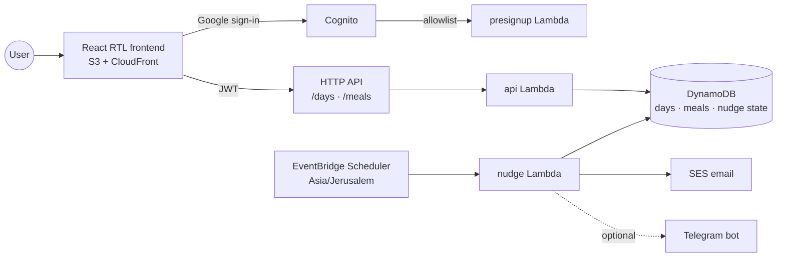

# diet-tracker

Serverless Hebrew diet tracker built around an intraday meal log, scored in points golf-style —
lower is better.

## Overview

- Meals are logged as they happen — carb grade, whether the meal included vegetables or fruit,
  and surcharge additions (sweet, alcohol, nuts) — and can be backfilled to yesterday for
  after-midnight logging.
- The day's values derive from the log: carb score, meal count, vegetable meals, and the eating
  window between first and last meal.
- Recorded meals floor the end-of-day questionnaire — a day can admit more than was tracked, never
  less — and a fully tracked day closes from the tracker with only water entered.
- Proactive nudges: fill reminders while a day is unsubmitted, threshold alerts over consecutive
  violating days, a weekly averages digest, and a 7-day trend chart after each submit.

## Tech stack

- **Backend** — Python 3.13 Lambdas behind an HTTP API, three DynamoDB tables, EventBridge
  Scheduler (Asia/Jerusalem)
- **Frontend** — React (TypeScript + Vite) RTL app on S3 + CloudFront, Recharts, TanStack Query
- **Auth** — Cognito Google sign-in gated by a small allowlist
- **Notifications** — SES email, optional Telegram bot

## Architecture

Meal scoring is implemented once per runtime — `src/common/derive.py` (the authority) and
`frontend/src/derive.ts` (live dashboard feedback) — and both must satisfy the shared vectors in
`config/derive-vectors.json`. Questions, their numeric choice values, and the threshold alert
rules are one versioned config: `config/questionnaire.json`.

## Details

- [Domain rules](docs/domain-rules.md) — scoring model, day lifecycle, and nudge behavior
- [Development & deployment](docs/development.md) — local setup, tests, deploy scripts, and
  Telegram configuration
