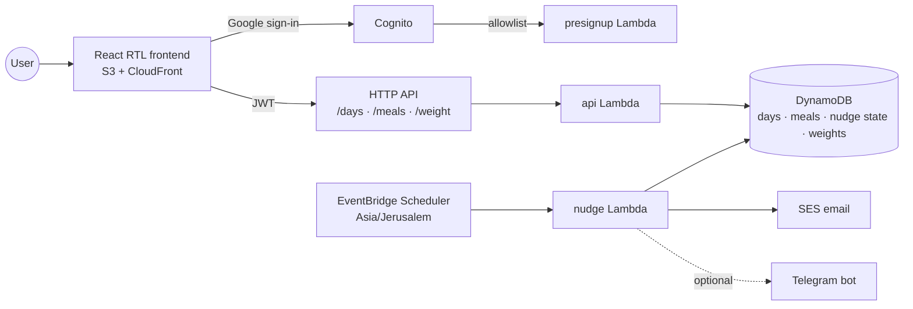

# diet-tracker

Free multi-user SaaS: a serverless Hebrew diet tracker built around an intraday meal log, scored
in points golf-style — lower is better.

**[Walk through a tracked day](https://dwyjxouhdjlxp.cloudfront.net/demo.html)** — an animated
replay of one session on a phone screen: sign-in, three meals logged as they happen, the day
closed from the tracker, and the week's trend over recorded history.

## Overview

- Meals are logged as they happen and can be backfilled to yesterday for after-midnight logging.
- The day's summary values derive from the log: three of the four principles — vegetable meals, the
  eating window between first and last meal, and the meal count — plus the carb score.
- Recorded meals floor the day-summary questionnaire — a day can admit more than was tracked, never
  less — and a fully tracked day closes from the tracker with only water entered, the one principle
  the log cannot derive.
- A weight log runs alongside the day tracker on its own weekly rhythm: measurements charted
  against a target the user sets. Weight is measured, not scored — it enters no day score and no
  alert.
- Proactive nudges leave the app by email, and by Telegram where a bot token is configured: fill
  reminders while a day is unsubmitted, a weekly weigh-in reminder that skips anyone already
  weighed this week, threshold alerts when a principle or the carb score stays past its limit for
  consecutive days, and a weekly averages digest. The 7-day trend chart after each submit is the
  one nudge shown in the app itself.
- The four principles are the שכפ"צ acronym the questions carry as a prefix — water intake,
  vegetable portions, a short eating window, fewer meals — spelled out in a table closing the
  signed-out landing.

## Tech stack

- **Backend** — Python 3.13 Lambdas behind an HTTP API, four DynamoDB tables, EventBridge
  Scheduler (Asia/Jerusalem)
- **Frontend** — React (TypeScript + Vite) RTL app on S3 + CloudFront, Recharts, TanStack Query
- **Auth** — Cognito Google sign-in gated by a small allowlist
- **Notifications** — SES email, optional Telegram bot

## Architecture

The backend is a modular monolith on serverless infrastructure: every Lambda is a thin entry point
(`src/handlers/`) over one shared domain core (`src/common/`), and all functions deploy from a
single code package against the same DynamoDB tables. Features are separated by Python modules,
keeping the domain logic in one place while Lambda still provides independent scaling and
scheduling per entry point.

Meal scoring is implemented once per runtime — `src/common/derive.py` (the authority) and
`frontend/src/derive.ts` (live dashboard feedback) — and both must satisfy the shared vectors in
`config/derive-vectors.json`. `config/app.json` is the app-level config both runtimes read: the
questionnaire element holds the questions, their numeric choice values, and the threshold alert
rules; the weight element holds the weigh-in schedule, the chart's opening span, and the kilogram
bounds the API and the input both constrain to.

## Details

- [Domain rules](docs/domain-rules.md) — scoring model, day lifecycle, and nudge behavior
- [Development & deployment](docs/development.md) — local setup, tests, deploy scripts, and
  Telegram configuration
