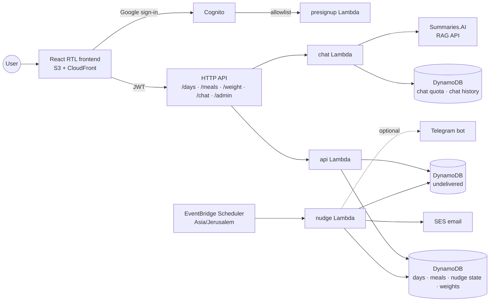

# diet-tracker

Free multi-user SaaS: a serverless Hebrew diet tracker built around an intraday meal log. No
calories are counted: what the log scores is the character of each meal and the intervals between
meals, in points golf-style — lower is better.

**[Walk through a tracked day](https://dwyjxouhdjlxp.cloudfront.net/demo.html)** — an animated
replay of one session on a phone screen: sign-in, three meals logged as they happen, the day
closed from the tracker, and the week's trend over recorded history.

## Overview

- Four principles carry the whole tracker: drinking enough water, vegetables in your meals, a short
  eating window, and few meals a day. Their Hebrew initials spell שכפ"צ, the prefix every question
  in the app carries, and a table at the foot of the signed-out page lists them with their targets.
- You log each meal as you eat it. Those entries answer three of the four principles by
  themselves — vegetables, eating window and meal count.
- Water is the fourth principle, the one meals cannot answer, so closing the day asks for it and
  nothing else. A day closes only from the tracker once its meals span the configured minimum
  eating window (six hours today), and stays
  closable through the small hours after midnight; a day never logged goes unrecorded. A closed
  day stays readable, and one confirmation reopens it — record deleted, meals kept — to add a
  forgotten meal and close again.
- Beyond the four principles, the same entries yield a daily carb score for flours and sugars,
  where lower is better.
- Weight is tracked on its own weekly rhythm, beside the daily log: each weigh-in is charted
  against a target you set, and carries the hour it was taken at, because a weekly weighing only
  compares with itself when it is taken at about the same time of day. The section reads back
  where you stand in that rhythm and opens itself on the weigh-in morning. Weight is measured
  rather than scored, so it changes no day's score and raises no alert.
- Reminders go out by email, and by Telegram where a bot token is configured: a last call for a
  day still unclosed, a weekly weigh-in reminder that skips anyone who already weighed in that
  day, an alert when a principle or the carb score stays past its limit several days running, and
  a weekly recap of the week that just ended — one line counting its closed days and the ones
  that broke a rule, under it three to four bullets saying what went well, how many days ask for
  attention and why, and what to try next, written from those days and the latest weigh-ins
  beside the target weight. That recap is also stored as an answered chat, so it appears in the
  chat list and can be followed up there like any other. Every message is sent as right-to-left
  HTML beside its plain text, so Hebrew reads as written rather than as the recipient's mail
  client guesses. Inside the app, a 7-day trend chart shows after each closed day;
  its carb panel plots the part of each day's score that came from flours and sugar beside the
  score itself, and frames the weekday the program's treat meal is aimed at.
  The account menu turns all reminders off and back on. A reminder SES refuses to deliver — the
  address is not one the sending account may write to — is kept and shown behind the header's
  alarm bell instead, dated, until it is dismissed there, so a message addressed to someone still
  reaches them rather than ending in a log line. The bell shows the mail itself: the same HTML the
  email carried, drawn in a frame that may do nothing but draw it.
- Questions about the diet's principles are answered inside the app: a chat section sends each
  question to the knowledge base of the diet's source documents, hosted on
  [Summaries.AI](https://github.com/erancha/Summaries.AI-public), and shows the answer with the
  documents it drew on. Each question also carries the asker's own recent tracked data — the
  last week's day summaries and the meals of today and yesterday — so answers can cite it; this
  means that data leaves the app for the external answering service and the LLM behind it. Questions are capped
  per user per day, because each one spends money upstream. Every answered turn is stored per
  user, so the conversation survives reloads and follows its user across devices.
- The admin account alone gets a user-activity section: every signed-up account with its
  closed-day and meal counts over the trailing week, most active first. It carries counts and
  addresses only — no one's recorded content is readable there.

## Tech stack

- **Backend** — Python 3.13 Lambdas behind an HTTP API, seven DynamoDB tables, EventBridge
  Scheduler (Asia/Jerusalem)
- **Frontend** — React (TypeScript + Vite) RTL app on S3 + CloudFront, Recharts, TanStack Query
- **Auth** — Cognito Google sign-in gated by an allowlist regex (".*" opens sign-up to
  everyone); the admin is emailed about each new user
- **Notifications** — SES email, optional Telegram bot
- **Knowledge-base chat** — Summaries.AI RAG API over the diet documents; its API key lives in
  SSM Parameter Store and is read per request, so rotating it needs no redeploy

## Architecture

The backend is a modular monolith on serverless infrastructure: every Lambda is a thin entry point
(`src/handlers/`) over one shared domain core (`src/common/`), and all functions deploy from a
single code package against the same DynamoDB tables. Features are separated by Python modules,
keeping the domain logic in one place while Lambda still provides independent scaling and
scheduling per entry point.

Meal scoring exists as one implementation per language — `src/common/derive.py` in the Python
backend (the authority) and `frontend/src/derive.ts` in the browser for live dashboard
feedback — and both must satisfy the shared vectors in `config/derive-vectors.json`. `config/app.json` is the app-level config both runtimes read: the
questionnaire element holds the questions, their numeric choice values, and the threshold alert
rules; the day_close element holds the small-hours bounds up to which yesterday may still be
closed or deleted; the weight element holds the weigh-in schedule, the chart's opening span, and
the kilogram bounds the API and the input both constrain to; the treat_day element names the
weekday the trend chart frames.

## Details

- [Domain rules](docs/domain-rules.md) — scoring model, day lifecycle, and nudge behavior
- [Development & deployment](docs/development.md) — local setup, tests, deploy scripts, and
  Telegram configuration

## License

Released under the MIT License. See [LICENSE](LICENSE).
