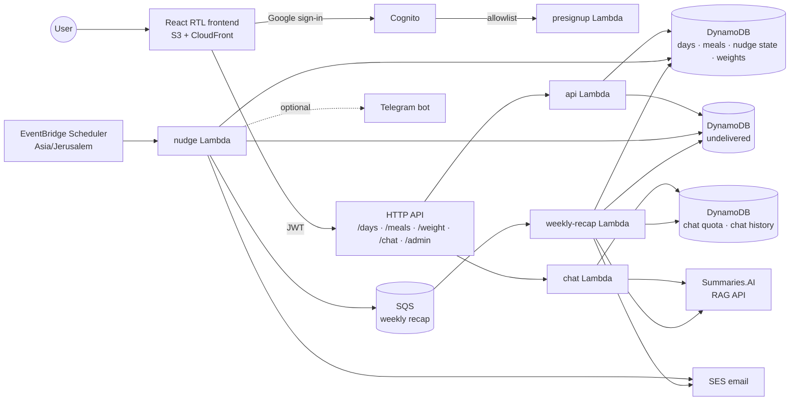

# Architecture

Nothing in this app runs between requests. The browser holds the whole user interface; each
request wakes a small Python function, which reads and writes a handful of DynamoDB tables and
then stops. Scheduled jobs wake the same way, on a clock rather than on a request.

## One body of code, several doors

The Python side is a single shared core (`src/common/`) with thin entry points in front of it
(`src/handlers/`). Every entry point deploys from the same package and reads the same tables, so
the rules live in one place; what differs between them is only when they wake and what they are
allowed to do. Splitting them this way still buys independent scaling and independent scheduling
per door, without splitting the rules across services.

## The doors

- **presignup** — runs while Cognito is creating an account, and is the only thing standing
  between a Google sign-in and a new user. It matches the address against an allowlist pattern
  and turns away anything that fails. For an address that passes it asks SES to send its
  verification request — without which the sandboxed SES account cannot mail that address at
  all — and tells the admin someone new has joined.
- **api** — everything the signed-in app asks for: the day being tracked, its meals, the recorded
  history, the weight log, and the admin listing. It holds the authority over what a closed day
  may claim.
- **chat** — kept apart from `api` because it is the one feature that spends money per use, and
  because it talks to a service outside this stack. It reads its API key per request from SSM
  Parameter Store, so rotating the key needs no redeploy.
- **nudge** — woken by the clock rather than by a request. It sends the day's last call and the
  weekly weigh-in reminder, and queues the weekly recap, one message per user, returning in
  seconds whatever the pool size.
- **weekly-recap** — answers one queued user at a time: reads their week, asks the answering
  service for its reading of it, and sends the email. Each user has an invocation of their own,
  so a slow reading delays no one else, and a crash parks that one user's message in a
  dead-letter queue instead of dropping everyone queued behind them.

## Scoring lives in two languages

The meal scoring exists twice, on purpose: `src/common/derive.py` in the backend and
`frontend/src/derive.ts` in the browser. The Python one is the authority — it re-derives a closing
day from its stored meals and refuses figures the meals do not support. The TypeScript one exists
so the day's numbers move as you type, before anything is sent.

Two implementations of one rule can drift, so both are held to the same shared test vectors in
`config/derive-vectors.json`. A change to one that the other does not match fails the suite.

## Configuration both sides read

`config/app.json` is the single file that describes the questions, their values, the alert
thresholds, the closing windows, the weigh-in schedule and the weekday the trend chart frames.
Both runtimes read the same file: the deployed package carries it, and the browser fetches it from
the site's own origin.

One part is lifted out at deploy time rather than read at run time — the weigh-in weekday and hour,
because a scheduled job's timing is fixed when the stack deploys.

[Versioned configuration](domain-rules.md#versioned-configuration) specifies each element and what
depends on it.

## Storage

Seven DynamoDB tables, each holding one kind of item under plain keys, with the user's Cognito
`sub` as the partition key: the day records, the meals, the nudge state, the weights, the chat
quota, the chat history, and the messages that could not be delivered. There are no joins, and no
table is ever scanned across users — even the admin listing takes its list of accounts from
Cognito and then reads each user's own partition.
